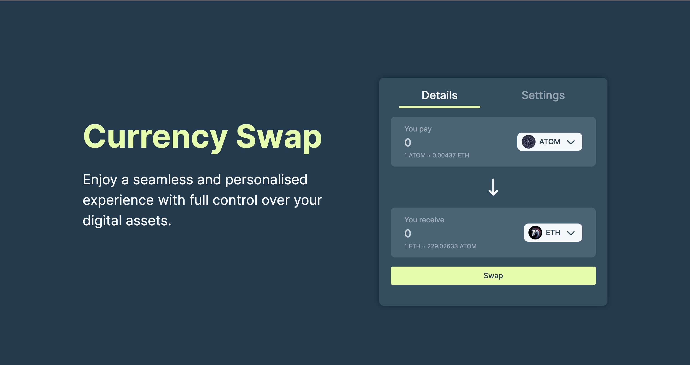

# switcheo-code-challenge

This repo contains solutions to the Switcheo Code Challenge (Frontend).

## About me 👋🏼

Hi there, I'm Vivienne Ching, a penultimate year undergrad studying computer science and economics at NTU. To me, software development is an area that truly excites me as it provides me with a canvas to express my creativity while simultaneously challenging my problem-solving skills. My journey in this field has been enriched with diverse experiences and I've undertaken internships covering software development and project management. On top of that, I've also accomplished the publication of my own iOS application. For more about me, do check out my [LinkedIn](https://www.linkedin.com/in/vivienneching/) :-)

## Tasks

All codes can be found in their respective folders in `src/`.  
To view the website for task 2, simply [click here](https://buymetehbing.github.io/switcheo-code-challenge/).  
As for task 3, I've stated the issues in `sample.tsx` and provided my refactored version in `solution.tsx`.

## Screenshot

